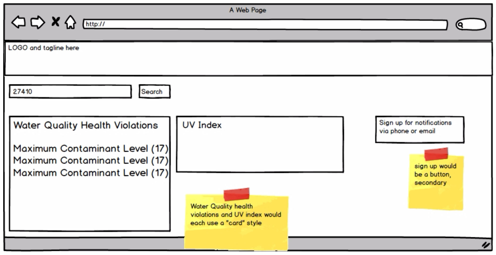

##User Centered Design Approach

###Discovery:

After some discussion about EPA's strategic plans and opportunities on the web to further the agency's mission, we decided to build something to serve the public--a product that would fill a gap in EPA's service to citizens and be immediately useful and understandable. We documented our assumptions, hypothesis and a few key tasks. We then conducted several user interviews to test the value of our potential solution.

  
In parallel to user interviews,  several technical team members and subject-matter experts with historical knowledge of EPA data reviewed available data to understand its characteristics, context and presentation against user scenarios. The team pulled together an initial list of data for consideration.
  

  
###Visioning:

The team began by developing a "Vision Canvas," a single document meant to articulate the "elevator pitch" for the product: Who uses it? What is its value? What problems is it solving? How will we measure success?

The Vision Canvas articulated what types of users we would target with the first release of our product, and what value the product would deliver. From there, we defined two personas; they were used to ensure we considered all contexts of use and identified the most critical features to build first to best serve user needs. 

###Co-development:

Our product manager, UX designer and developer collaborated via Skype, Webex, phone and Facetime to deliver elements of a working product as quickly as possible. We created little documentation, instead using hand-drawings, Balsamiq wireframes, and real-time development to execute faster. Our developer used an existing framework to stand up the product quickly--it looked great "out of the box" and more importantly, it enabled us to begin user testing immediately, as well as to identify UI elements that would need to be defined via a style guide.

###Testing:

Our project team tested features constantly, but we also put our core group of users to work reviewing the latest release. An email was sent to this group every morning outlining what had changed and asking them to test. Later in the day, the user group gathered to review and prioritize feedback. High priority items were added to the project board and then flagged as "MVP," and remaining items were added to the backlog for later consideration. In addition to unit and user testing, once the core MVP was developed we brought in technical and accessibility experts to provide additional perspective and review code. Their feedback was also captured in the backlog.

